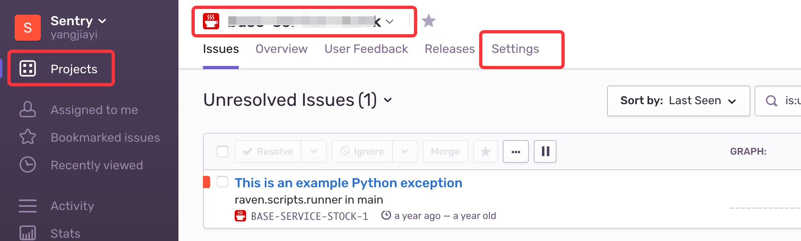
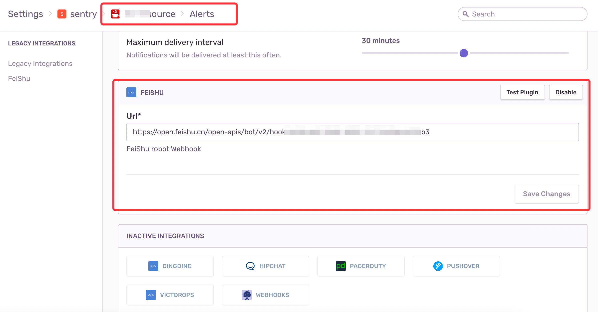
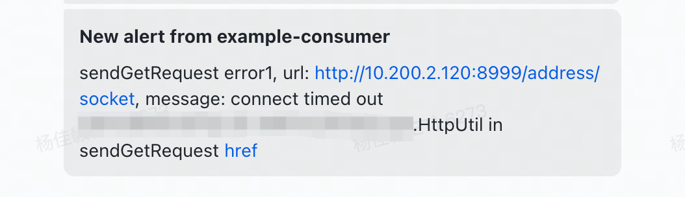

# Sentry-FeiShu

`Sentry`的`飞书`通知插件

## 安装

* 方式1: 进入sentry的安装目录执行一下命令
```bash
$ pip install git+https://github.com/DC-ET/sentry-feishu.git
```

* 方式2: 手动下载本项目, 并拷贝至sentry的安装目录下, 然后在sentry目录下执行以下命令
```bash
$ pip install sentry-feishu
```

## 使用

在`项目`的 Settings > Alert 找到`FeiShu`插件，启用，并设置`Webhook`



在插件上使用`Test Plugin`进行测试，当配置好`Webhook`后，在飞书群内会得到以下警告



点击`href`按钮，打开异常详情页面。

### 如何获取飞书Webhook?

飞书客户端 > 创建群聊 > 群设置 > 群机器人 > 添加机器人 > Custom Bot > 添加 > 获取webhook